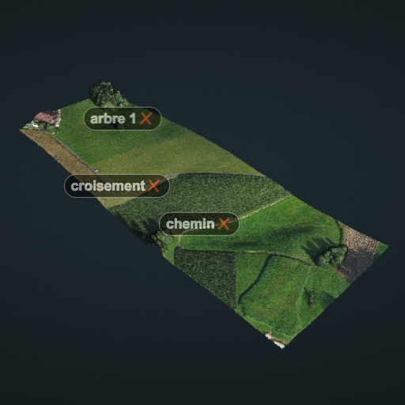

# Aryballe project   Play with Lidar data and NoSQL technologies
Projet réalisé avec dans le cadre d'un cours sur les technologies NoSQL - <b>[YNOV](https://www.ynov.com) Nanterre (JUIN 2018)</b>. 

Le principe de ce projet est de permettre d'explorer les différentes notions de gestion de documents (stockage, transfert, traitement, ...) et de visualisation de ces documents selon leur contexte (opaque, structuré, modifiable, ...). Nous partons du principe ou le métier - sujet - est à prendre comme outil de base pour la mise en place de structure traitant des données : pour ne pas succomber aux différentes modes en terme de développement, il est essentiel de concentrer ses efforts en priorité sur la modelisation des données métiers. Une fois le model de document défini, le choix de tel ou tel technologie de gestion de données devient alors un levier pour décupler l'efficacité - et l'exécution - d'une application.

Basé sur les données [Lidar](https://fr.wikipedia.org/wiki/Lidar), le Aryballe Project permet de visualiser une carte en 3 dimensions et offre des outils pour identifier les différents éléments qui constituent la carte. L'indexation des différents points de la carte est à faire par plusieurs membres d'une équipe dans des environnements différents qui doivent être synchronisés en temps réel pour afficher les mêmes informations.

## Définition des problématiques
- Les informations à manipuler sont de nature diverce mais doivent interagir les unes avec les autres
- Les modes de productions de l'information sont multiples et doivent être évolutives
- Chaque type d'information doit avoir une structure spécifique défini par l'information elle-même
- La méthode de stockage doit être définie selon l'utilisation métier de information
- Les startégies de redistribution doivent permettre d'optimiser l'access à l'infromation

## Technologies
- [Lidar Data](https://fr.wikipedia.org/wiki/Lidar)
- [Potree](http://potree.org)
- [ES6^](http://es6-features.org/#Constants)

### Auteurs
- Damien Truffaut [Linkedin](https://www.linkedin.com/in/damient75/)
- Julien Noyer [Linkedin](https://www.linkedin.com/in/julien-noyer-21219b28/)