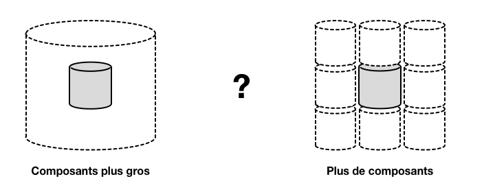
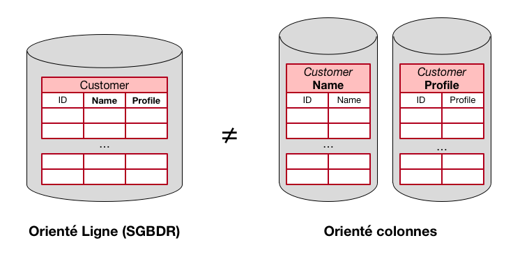
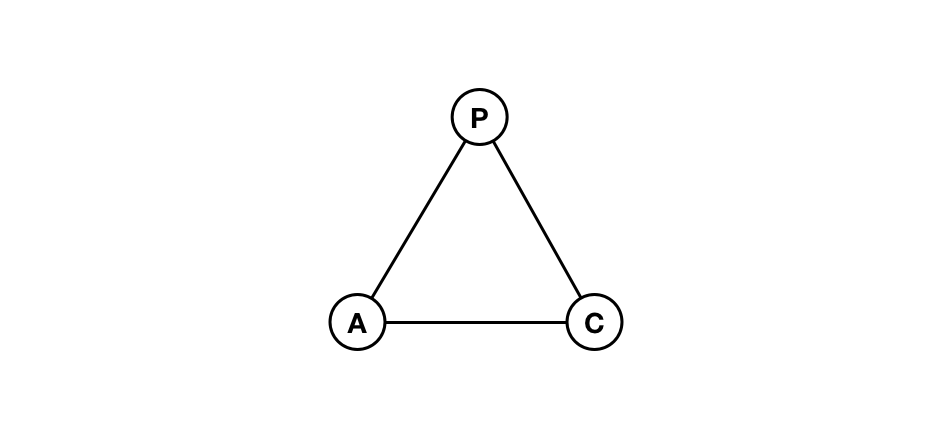
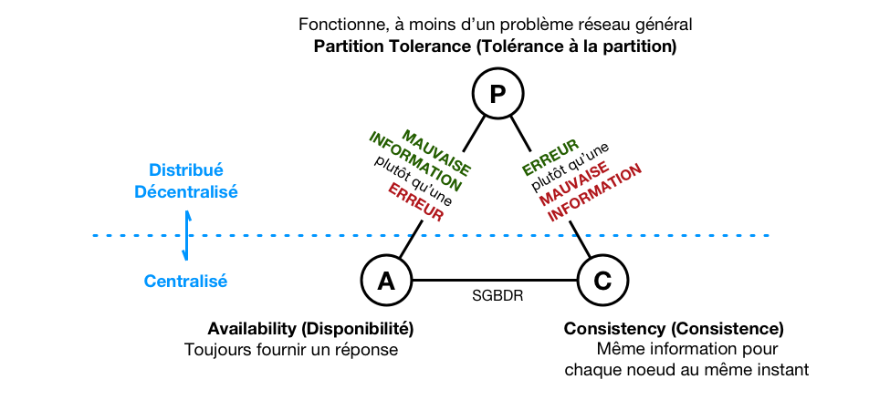
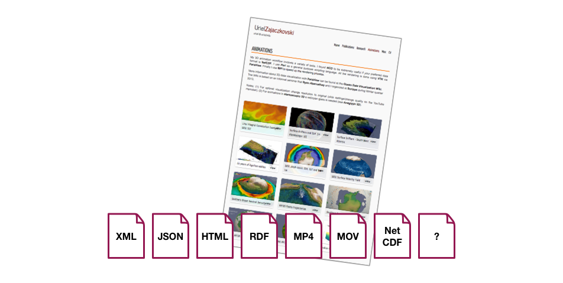
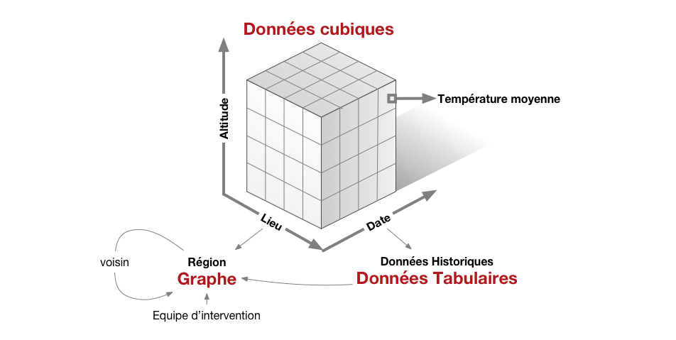

# Modalité de stockage

> Choisir une modalité de stockage de l'information, c'est résoudre un équation qui met face à face une demande et des "solutions disponibles".

# Elaborer des critères

| Projet | Organisation | Implémentation |
|---|---|---|
| Autorité | Transfert de technologie | Sécurité |
| Résilience | Apprentissage | Redondance |
| Evolutivité | Durée du projet | Interfaces |
| Répartition | Prix | Stockage |

---

## Autorité / Gouvernance

> Qui a autorité sur le projet (une ou plusieurs organisations ou société ?)

- Unique
- Multiple

---

## Résilience

> Tolérances aux pannes issues de bug, crash, comportement malicieux ou indisponibilité de services ?

- Standard <!-- Vue de l'intérieur (log => médecine) -->
- Byzantine <!-- Vue de l'extérieur (analyse croisée) -->

<!-- (*≠ informations -> consensus*) -->

---

## Evolutivité

> Sous quelle forme le système va-t-il évoluer ?

- Homogène (multiplication d'un modalité unique)
- Hétérogène (panachage de solution)

---

## Répartition

> Où l'information est elle située ?

- Centralisée
- Distribuée
- Décentralisée

---

### Croissance

---

### Partitionnement vertical

---

### Partitionnement horizontal

---

### Base de données relationnelle ?

---

# Organisation

---

## Transfert de technologie

> Les acteurs ont ils les moyens d'accéder à l'information ?

- Open source
- Closed source

---

## Compétences requises

> Quelle est la nature des compétences nécessaires ?

- Généraliste (SQL, SPARQL...)
- Spécifique (*locking*)

---

## Durée du projet

> Dans quels termes la réalisation du projet s'inscrit elle ?

- Court terme
- Moyen terme
- Long terme

---

## Mécanique de prix

> Combien et quand doit on payer ? pourquoi (logiciel, service)

- Gratuit
- Sous Licence

---

## Dépendance

- sans (open source)
- ponctuelle (achat logiciel, mise à jour)
- récurrente (abonnement à une license)
- continue (utilisation d'un service extérieur)

---

# Mode de réalisation

---

## Sécurité

> Où se situe la sécurisation du système (cryptage) ?

- Au repos (stockage)
- A l'échange (communication)

---

## Redondance

> Comment l'information est-elle repliquée ?

- Réplication
- Code d'effacement

---

### C.A.P ?

---

### C.A.P !

---

## Interfaces

> Quelles sont les modalités d'accès aux informations ?

- Format
- API
- Protocole

---

## "Formes" de stockage

> Sous quelle forme est stockée l'information ?

- *Block*, Fichier, Clef-Valeur
- Relationnelle, Orientée Ligne (*SGBD*), Orientée colonne
- Objet, Document, Graphe  & Triple Store

---

### "Format" des données

---

### "Forme" des informations

---

## Récapitulatif

| Projet | Organisation | Implémentation |
|---|---|---|
| Autorité | Transfert de technologie | Sécurité |
| Résilience | Apprentissage | Redondance |
| Evolutivité | Durée du projet | Interfaces |
| Répartition | Prix | Stockage |

---

## Typologie de solutions

- Objets
- Base de données orientées "colonne"
- Documents
- Graphes
  - Triple Store

---

- <http://nosql-database.org/>
- <https://db-engines.com/>
