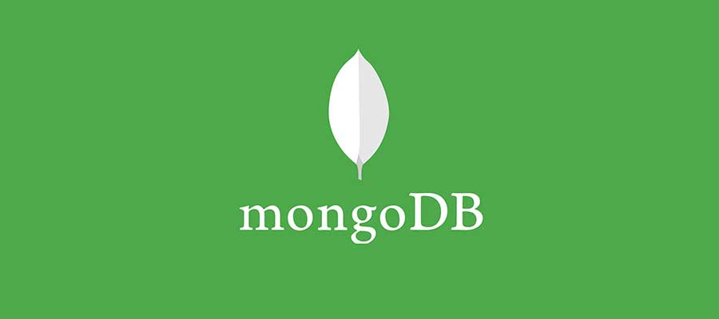

## Présentation
__MongoDB__ est un gestionnaire de base de données [NOsql](http://nosql-database.org) orientée documents, c'est à dire qu'au lieu d'utiliser une base de données relationnelle, nous utiliserons _des collections de documents propulsées au format JSON_. __MongoDB__ rencontre un [franc succès auprès des développeurs](https://www.g2crowd.com/categories/nosql-databases) Javascript car il est recommander dans la mise en place de projets utilisant la structure MEAN mais bon nombre d'autres systèmes de base de données NoSql proposent des [principes équivalent](https://fr.wikipedia.org/wiki/Base_de_données_orientée_documents).

Les bases de données orientée documents ([wikipedia](https://fr.wikipedia.org/wiki/Base_de_données_orientée_documents)) gèrent l'information sous la forme de _documents_ enregistrés dans des _collections_. Les _collections_ sont comparables aux _tables_, et les _documents_ aux _enregistrements_ des bases de données relationnelles. En MongoDB, les propriétés d'un _documents_ sont libres et peuvent être différentes d'un _documents_ à un autre au sein d'une même _collection_, la seul propriétés commune obligatoire est la clé principale du _documents_ : ___id__.

## Installation de MongoDB
Plusieurs solution s'offrent à vous pour installer __MongoDB__ selon votre système d'exploitation. Nous prenons en référence dans ce Wiki le langage `Linux` pour l'installation et la configuration car lors du déploiement de votre application sur un `VPN`, vous devrez dialoguer en `Linux` avec le serveur pour y installer MongoDB.

Installation de [MongoDB](https://docs.mongodb.com/manual/administration/install-community/) avec Homebrew :
```
sudo brew install mongodb --with-openssl
```
Installation de [MongoDB](https://docs.mongodb.com/manual/administration/install-community/) avec NPM :
```
sudo npm install mongodb -g
```
> Pour plus d'informations sur l'installation de __MongoDB__, vous pouvez vous référer au [site de référence](https://docs.mongodb.com/manual/administration/install-community/).

L'installation de MongoDB sous Windows se fait en téléchargeant l'application directement sur votre ordinateur en choisissant la bonne version sur le site de MongoDB à l'adresse suivante :
```
https://www.mongodb.com/download-center#community
```

## Configuration de l'espace de travail
Pour utiliser __MongoDB__ vous devez créer un dossier sur votre machine pour héberger le serveur de base de données NoSQL. Vous pouvez choisir de définir soit un dossie global pour toutes vos base de données (recommandé), soit crèer une serveur de base de données par projet. La première solutions semble la meilleur dans la mesure ou il n'est pas nécessaire de dupliquer les serveurs de base de données quand un seul suffi et prendra moins de place sur votre machine - pour information le serveur pèse à lui seul plus de 300 MO.

Vous devez donc à présent crèer un dossier `data` à la racine de votre machine (Macintosh HD) qui vous permettra d'héberger votre serveur de base de données MongoDB. Une fois le dossier créé, ouvrez une fenêtre de terminal pour taper la commande suivante :
```
sudo mongod
```

Vous pouvez également lancer le serveur dans un dossier spécifique avec le drapeau `--dbpath` comme dans la commande suivante :
```
sudo mongod --dbpath path/to/other/data/folder
```

## Le shell Mongo
La manipulation de [MongoDB](https://docs.mongodb.com/manual/administration/install-community/) se fait grâce à un shell qu'il faut lancer depuis une fenêtre d'invité de commande. Des logiciels comme [Studio 3T](https://studio3t.com/?gclid=EAIaIQobChMI5pyz89y32wIVk4XVCh3efACREAAYASAAEgLvBfD_BwE) permettent d'avoir une interface graphique pour manipuler [MongoDB](https://docs.mongodb.com/manual/administration/install-community/)

Lancer le shell
```
sudo mongo
```

Vider le shell
```
cls
```

Sortir du shell
```
exit
```
<hr>

### Références

- [Base de données du NOsql](http://nosql-database.org)
- [Base de données orientée documents](https://fr.wikipedia.org/wiki/Base_de_données_orientée_documents)
- [MongoDB Community Edition](https://www.mongodb.com/community)
- [MongoDB by Derek Banas - Youtube](https://www.youtube.com/watch?v=-0X8mr6Q8Ew)

### Auteurs
- Damien Truffaut [Linkedin](https://www.linkedin.com/in/damient75/)
- Julien Noyer [Linkedin](https://www.linkedin.com/in/julien-noyer-21219b28/)
